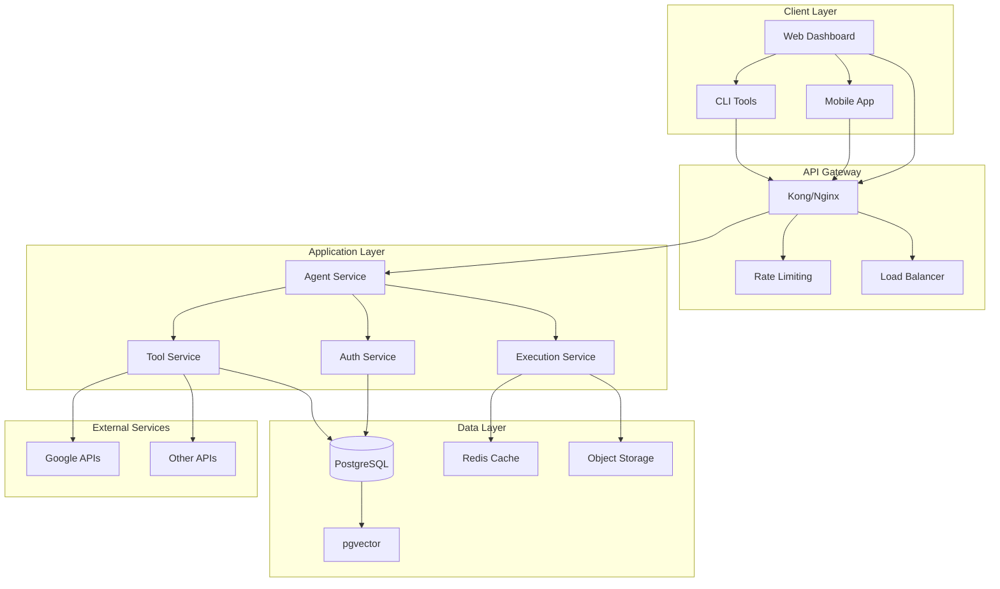

# Product Requirements Document: LangChain Agent API

## 1. Visi Produk
Membangun API berbasis LangChain yang memungkinkan pengguna membuat agen AI kustom dengan kemampuan memilih tools spesifik sesuai kebutuhan, dengan otentikasi dinamis dan performa tinggi untuk menangani banyak pengguna secara bersamaan.

## 2. Target User
- Developer yang membutuhkan otomatisasi cerdas
- Perusahaan yang ingin mengintegrasikan AI ke workflow
- Tim teknis yang membutuhkan solusi otomatisasi tanpa coding mendalam
- Pengguna non-teknis yang ingin membuat agen dengan antarmuka sederhana

## 3. Fitur-Fitur Teknis

### 3.1. Agent Creation & Management
- **Dynamic Agent Configuration**: 
  - Endpoint `POST /agents` untuk membuat agen dengan payload JSON
  - Pemilihan tools dari katalog tersedia
  - Konfigurasi parameter agen (model LLM, memory type, reasoning strategy)
  
- **Agent Lifecycle Management**:
  - `GET /agents/{id}` - Detail agen
  - `PUT /agents/{id}` - Update konfigurasi
  - `DELETE /agents/{id}` - Hapus agen
  - `POST /agents/{id}/execute` - Jalankan agen dengan input spesifik

### 3.2. Tools Ecosystem
- **Built-in Tools**:
  - Google Workspace (Gmail, Docs, Sheets, Calendar)
  - Database tools (PostgreSQL)
  - File operations (CSV, PDF, Excel, PPTX, DOCX, TXT)
  - Web scraping & API integration

- **Custom Tools Registration**:
  - `POST /tools` - Mendaftarkan tools kustom
  - Validasi input/output dengan JSON Schema
  - Isolasi eksekusi dengan Docker sandbox

### 3.3. Dynamic Authentication System
- **Google OAuth Integration**:
  - Generate OAuth link saat pembuatan agen dengan tools Google
  - Scope otomatis disesuaikan dengan tools dan aksi yang dipilih:
    ```json
    {
      "tools": ["gmail:read", "gmail:draft", "sheets:read"],
      "auth_scopes": [
        "https://www.googleapis.com/auth/gmail.readonly",
        "https://www.googleapis.com/auth/gmail.compose",
        "https://www.googleapis.com/auth/spreadsheets.readonly"
      ]
    }
    ```
  - Token management dengan refresh otomatis
  - Enkripsi token di database

- **Authentication Flow**:
  1. User buat agen dengan tools Google
  2. API return response dengan auth link:
     ```json
     {
       "agent_id": "uuid",
       "auth_required": true,
       "auth_url": "https://accounts.google.com/oauth?scope=...&state=..."
     }
     ```
  3. User klik link dan authorize
  4. Google redirect ke callback endpoint
  5. Simpan token dengan scope terbatas sesuai tools yang dipilih

## 4. Arsitektur Sistem

### 4.1. High-Level Architecture

 
 
## 4.2. Component Details
Agent Service: Mengelola pembuatan, konfigurasi, dan manajemen agen
Auth Service: Mengelola otentikasi, otorisasi, dan token management
Tool Service: Mengelola registrasi, validasi, dan eksekusi tools
Execution Service: Menjalankan agen dengan asynchronous processing
PostgreSQL: Penyimpanan data agen, user, konfigurasi, dan token
pgvector: Penyimpanan vektor untuk embedding dan similarity search
Redis: Caching hasil eksekusi dan session management
Object Storage: Penyimpanan file hasil eksekusi dan temporary data

## 5. Requirements Teknis
### 5.1. Functional Requirements
Endpoint
Method
Description
Request Body
Response
/agents	POST	Create new agent	{name, tools, config}	{agent_id, auth_url}
/agents/{id}	GET	Get agent details	-	Agent configuration
/agents/{id}/execute	POST	Execute agent	{input, parameters}	Execution result
/tools	GET	List available tools	-	Tools catalog
/tools	POST	Register custom tool	Tool definition	Tool ID
/auth/google/callback	GET	OAuth callback	{code, state}	Success/error
### 5.2. Non-Functional Requirements
Category
Requirement
Specification
Performance	Latency	<500ms for API calls, <2s for simple agent execution
Throughput	10,000+ concurrent requests	
Scalability	Horizontal scaling	Auto-scaling based on load
Availability	Uptime	99.95%
Security	Data encryption	TLS 1.3, AES-256 for data at rest
Compliance	GDPR ready	Data retention policies, audit logs

## 6. Database Design
###6.1. PostgreSQL Schema
-- Users table
CREATE TABLE users (
    id UUID PRIMARY KEY DEFAULT gen_random_uuid(),
    email VARCHAR(255) UNIQUE NOT NULL,
    password_hash VARCHAR(255) NOT NULL,
    created_at TIMESTAMPTZ DEFAULT NOW(),
    updated_at TIMESTAMPTZ DEFAULT NOW()
);

-- Agents table
CREATE TABLE agents (
    id UUID PRIMARY KEY DEFAULT gen_random_uuid(),
    user_id UUID REFERENCES users(id),
    name VARCHAR(255) NOT NULL,
    config JSONB NOT NULL,
    status VARCHAR(50) DEFAULT 'active',
    created_at TIMESTAMPTZ DEFAULT NOW(),
    updated_at TIMESTAMPTZ DEFAULT NOW()
);

-- Tools catalog
CREATE TABLE tools (
    id UUID PRIMARY KEY DEFAULT gen_random_uuid(),
    name VARCHAR(255) UNIQUE NOT NULL,
    description TEXT,
    schema JSONB NOT NULL,
    type VARCHAR(50) NOT NULL, -- 'builtin' or 'custom'
    created_at TIMESTAMPTZ DEFAULT NOW()
);

-- Agent tools mapping
CREATE TABLE agent_tools (
    agent_id UUID REFERENCES agents(id),
    tool_id UUID REFERENCES tools(id),
    config JSONB,
    PRIMARY KEY (agent_id, tool_id)
);

-- Authentication tokens
CREATE TABLE auth_tokens (
    id UUID PRIMARY KEY DEFAULT gen_random_uuid(),
    user_id UUID REFERENCES users(id),
    service VARCHAR(50) NOT NULL, -- 'google', 'microsoft', etc.
    access_token TEXT NOT NULL,
    refresh_token TEXT,
    scope TEXT[] NOT NULL,
    expires_at TIMESTAMPTZ,
    created_at TIMESTAMPTZ DEFAULT NOW()
);

-- Execution history
CREATE TABLE executions (
    id UUID PRIMARY KEY DEFAULT gen_random_uuid(),
    agent_id UUID REFERENCES agents(id),
    input JSONB,
    output JSONB,
    status VARCHAR(50) NOT NULL,
    duration_ms INTEGER,
    created_at TIMESTAMPTZ DEFAULT NOW()
);

### 6.2. Vector Database (pgvector)
-- Enable pgvector extension
CREATE EXTENSION IF NOT EXISTS vector;

-- Create table for embeddings
CREATE TABLE embeddings (
    id UUID PRIMARY KEY DEFAULT gen_random_uuid(),
    agent_id UUID REFERENCES agents(id),
    content TEXT NOT NULL,
    embedding VECTOR(1536) NOT NULL, -- OpenAI embedding size
    metadata JSONB,
    created_at TIMESTAMPTZ DEFAULT NOW()
);

-- Create index for similarity search
CREATE INDEX ON embeddings USING hnsw (embedding vector_cosine_ops);


## 7. Security Model
### 7.1. Authentication & Authorization
User Authentication: JWT-based authentication with refresh tokens
API Security: API key for service-to-service communication
Google OAuth: Scope-limited access with minimal privileges
Token Storage: Encrypted at rest using AES-256
Permission Model: RBAC (Role-Based Access Control) for agent management
### 7.2. Data Protection
Encryption in Transit: TLS 1.3 for all communications
Encryption at Rest: AES-256 for sensitive data
Token Rotation: Automatic refresh for OAuth tokens
Audit Logging: All access and execution events logged


## 8. Performance & Scalability
### 8.1. Performance Optimization
Database Optimization:
Connection pooling with PgBouncer
Read replicas for query scaling
Indexing strategies for frequent queries
Partitioning for large tables (executions, embeddings)
Caching Strategy:
Redis for session data and frequent queries
Agent execution result caching
CDN for static assets
Asynchronous Processing:
Celery/RQ for background tasks
Message queue (RabbitMQ/Kafka) for task distribution
Webhook support for long-running operations
### 8.2. Scalability Architecture
Microservices: Independent scaling for each service component
Containerization: Docker containers with Kubernetes orchestration
Auto-scaling: Horizontal pod autoscaling based on CPU/memory
Load Balancing: Layer 7 load balancing with session affinity
Database Scaling: Read replicas and connection pooling


## 9. Monitoring & Observability
### 9.1. Monitoring Stack
Metrics: Prometheus + Grafana for system metrics
Logging: ELK stack (Elasticsearch, Logstash, Kibana)
Tracing: Jaeger for distributed tracing
Health Checks: Endpoint for service health monitoring
### 9.2. Key Metrics
API response times (P50, P90, P99)
Error rates by endpoint
Agent execution success rate
Database query performance
Authentication success/failure rates
Resource utilization (CPU, memory, storage)


## 10. Deployment Strategy
### 10.1. Infrastructure
Cloud Provider: AWS/GCP/Azure
Compute: Kubernetes cluster
Database: Managed PostgreSQL service (RDS/Cloud SQL)
Cache: Managed Redis service
Storage: Object storage (S3/GCS)
### 10.2. CI/CD Pipeline
Development: Feature branches with PR reviews
Testing: Automated unit, integration, and load tests
Staging: Environment for UAT and performance testing
Production: Blue-green deployment with zero downtime
Rollback: Automated rollback on failure detection


## 11. Risks & Mitigations
Risk
Mitigation
OAuth Token Compromise	Short-lived tokens, automatic rotation, minimal scope
Database Performance	Connection pooling, read replicas, query optimization
LLM Dependency	Multi-LLM support, fallback mechanisms
Tool Execution Security	Sandboxed execution, resource limits
High Load Handling	Auto-scaling, queueing, rate limiting
Data Privacy	Data encryption, anonymization, compliance checks

## 12. Success Metrics
Performance: 99th percentile latency < 1s for API calls
Reliability: 99.95% uptime
Scalability: Support 10,000+ concurrent agents
Adoption: 500+ active agents within 3 months
Security: Zero critical security incidents
