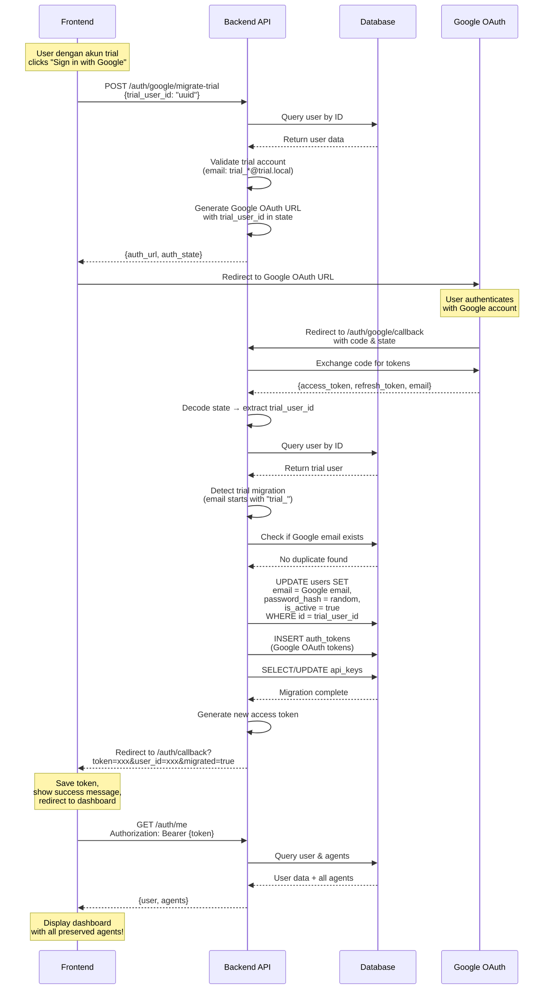

## Key Points

### 🔑 State Flow
The `state` parameter in OAuth contains:
```json
{
  "n": "nonce-uuid",
  "s": ["scopes"],
  "u": "trial_user_id"  // ← This identifies the trial user
}
```

### 🔄 Migration Logic
```python
# In callback, after getting Google token:
if user.email.startswith("trial_") and user.email.endswith("@trial.local"):
    # This is a trial migration!
    migrate_trial_to_google(
        trial_user_id=user.id,
        google_email=token_data["email"],
        google_token_data=token_data
    )
```

### 📊 Database Changes
```sql
-- Before Migration
SELECT * FROM users WHERE id = 'trial-user-id';
-- email: trial_abc123@trial.local
-- is_active: false
-- password_hash: <trial_password_hash>

-- After Migration  
SELECT * FROM users WHERE id = 'trial-user-id';
-- email: user@gmail.com
-- is_active: true
-- password_hash: <random_secure_hash>

-- Agents remain unchanged!
SELECT * FROM agents WHERE user_id = 'trial-user-id';
-- All agents still there with same configurations
```

### ✨ Zero Data Loss Guarantee
```
user_id: UNCHANGED ✅
  ↓
agents.user_id: UNCHANGED ✅
  ↓
All agents preserved ✅
```
