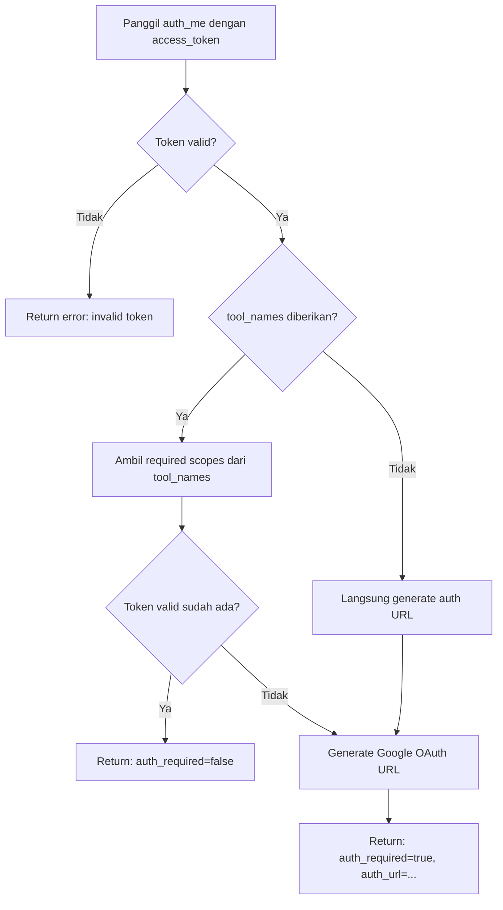

# 🔐 Auth Tools — Dokumentasi

Kategori ini mencakup semua tools yang berkaitan dengan autentikasi pengguna, registrasi, dan manajemen API key.

> 📁 Bagian dari [MCP Server Documentation](../README.md)

---

## Daftar Tools

| Tool | Deskripsi Singkat |
|---|---|
| [`register_user`](#register_user) | Daftarkan user baru |
| [`login_user`](#login_user) | Login dan dapatkan access token |
| [`generate_api_key`](#generate_api_key) | Generate API key untuk plan tertentu |
| [`create_trial_api_key`](#create_trial_api_key) | Buat trial API key berdasarkan IP |
| [`update_user_password`](#update_user_password) | Update password user |
| [`auth_me`](#auth_me) | Generate Google OAuth URL dari access token |

---

## `register_user`

**Daftarkan user baru dan auto-aktivasi untuk plan TRIAL/GUEST.**

TRIAL dan GUEST account langsung diaktivasi dengan API key — tidak perlu verifikasi email atau pembayaran. PRO_M dan PRO_Y dibuat tapi tidak aktif sampai pembayaran dikonfirmasi.

### Parameter

| Parameter | Tipe | Wajib | Default | Deskripsi |
|---|---|---|---|---|
| `identifier` | `str` | ✅ Ya | — | Alamat email atau nomor telepon |
| `password` | `str` | ✅ Ya | — | Password dalam plaintext |
| `plan_code` | `str` | ❌ Tidak | `"GUEST"` | Plan yang akan di-assign. Nilai: `GUEST`, `TRIAL`, `PRO_M`, `PRO_Y` |

### Response Sukses

```json
{
  "status": "success",
  "user_id": "550e8400-e29b-41d4-a716-446655440000",
  "email": "user@example.com",
  "is_active": true,
  "access_token": "eyJhbGciOiJIUzI1NiIsInR5cCI6IkpXVCJ9..."
}
```

> 💡 `access_token` hanya dikembalikan untuk plan TRIAL dan GUEST.

### Plan Code Reference

| Plan Code | Aktivasi Otomatis | API Key Langsung | Keterangan |
|---|---|---|---|
| `GUEST` | ✅ Ya | ✅ Ya | Akses terbatas, tidak perlu registrasi penuh |
| `TRIAL` | ✅ Ya | ✅ Ya | Akses trial dengan batas waktu |
| `PRO_M` | ❌ Tidak | ❌ Tidak | Berbayar bulanan, perlu konfirmasi pembayaran |
| `PRO_Y` | ❌ Tidak | ❌ Tidak | Berbayar tahunan, perlu konfirmasi pembayaran |

### Contoh Penggunaan

```python
# Daftar user baru dengan plan TRIAL
result = await register_user(
    identifier="user@example.com",
    password="SecurePass123",
    plan_code="TRIAL"
)
```

---

## `login_user`

**Autentikasi user dan kembalikan access token JWT.**

### Parameter

| Parameter | Tipe | Wajib | Deskripsi |
|---|---|---|---|
| `identifier` | `str` | ✅ Ya | Alamat email atau nomor telepon |
| `password` | `str` | ✅ Ya | Password dalam plaintext |

### Response Sukses

```json
{
  "status": "success",
  "user_id": "550e8400-e29b-41d4-a716-446655440000",
  "email": "user@example.com",
  "access_token": "eyJhbGciOiJIUzI1NiIsInR5cCI6IkpXVCJ9...",
  "token_type": "bearer"
}
```

### Response Error

```json
{
  "status": "error",
  "error": "Invalid credentials"
}
```

### Contoh Penggunaan

```python
result = await login_user(
    identifier="user@example.com",
    password="SecurePass123"
)
# Simpan access_token untuk digunakan di tools lain
token = json.loads(result)["access_token"]
```

---

## `generate_api_key`

**Generate API key untuk user dengan plan spesifik.**

Tool ini berguna saat user sudah terdaftar dan ingin mendapatkan API key baru untuk plan berbeda.

### Parameter

| Parameter | Tipe | Wajib | Default | Deskripsi |
|---|---|---|---|---|
| `identifier` | `str` | ✅ Ya | — | Alamat email atau nomor telepon |
| `password` | `str` | ✅ Ya | — | Password dalam plaintext |
| `plan_code` | `str` | ❌ Tidak | `"TRIAL"` | Plan code: `TRIAL`, `PRO_M`, `PRO_Y`, `GUEST` |

### Response Sukses

```json
{
  "status": "success",
  "access_token": "eyJhbGciOiJIUzI1NiIsInR5cCI6IkpXVCJ9...",
  "expires_at": "2026-03-26T11:57:24+07:00",
  "plan_code": "TRIAL"
}
```

### Contoh Penggunaan

```python
result = await generate_api_key(
    identifier="user@example.com",
    password="SecurePass123",
    plan_code="PRO_M"
)
```

---

## `create_trial_api_key`

**Buat trial API key berdasarkan IP address (guest access).**

Tool ini memungkinkan akses guest tanpa registrasi penuh — cukup berikan IP address pengingin akses.

### Parameter

| Parameter | Tipe | Wajib | Deskripsi |
|---|---|---|---|
| `ip_address` | `str` | ✅ Ya | Alamat IP user trial |

### Response Sukses

```json
{
  "status": "success",
  "access_token": "eyJhbGciOiJIUzI1NiIsInR5cCI6IkpXVCJ9...",
  "user_id": "550e8400-e29b-41d4-a716-446655440000",
  "expires_at": "2026-03-26T11:57:24+07:00"
}
```

### Contoh Penggunaan

```python
result = await create_trial_api_key(ip_address="192.168.1.100")
```

---

## `update_user_password`

**Update password user.**

### Parameter

| Parameter | Tipe | Wajib | Deskripsi |
|---|---|---|---|
| `user_id` | `str` | ✅ Ya | UUID user (format: `xxxxxxxx-xxxx-xxxx-xxxx-xxxxxxxxxxxx`) |
| `new_password` | `str` | ✅ Ya | Password baru (plaintext atau pre-hashed) |

### Response Sukses

```json
{
  "status": "success",
  "message": "Password updated"
}
```

### Response Error

```json
{
  "status": "error",
  "error": "Invalid user_id: 'abc'"
}
```

### Contoh Penggunaan

```python
result = await update_user_password(
    user_id="550e8400-e29b-41d4-a716-446655440000",
    new_password="NewSecurePass456"
)
```

---

## `auth_me`

**Generate Google OAuth URL dari access token user.**

Tool ini bekerja persis seperti endpoint `/auth/me + /google/auth` di Langchain API — tidak perlu mengetahui UUID user secara langsung. Gunakan tool ini ketika user perlu menghubungkan akun Google mereka setelah agent dibuat.

### Kapan Menggunakan
- User perlu connect akun Google setelah pembuatan agent
- Anda punya `access_token` dari `login_user/register_user` tapi **tidak** punya UUID user
- Perlu generate OAuth URL untuk scope Google tertentu

### Parameter

| Parameter | Tipe | Wajib | Default | Deskripsi |
|---|---|---|---|---|
| `access_token` | `str` | ✅ Ya | — | JWT access token dari `login_user` atau `register_user` |
| `tool_names` | `list` | ❌ Tidak | `null` | Daftar nama Google tools (e.g. `["gmail_send_message", "google_sheets_get_values"]`) untuk derive OAuth scope |
| `agent_id` | `str` | ❌ Tidak | `""` | UUID agent untuk scope OAuth grant ke agent tertentu |

### Response — Auth Diperlukan

```json
{
  "status": "success",
  "auth_required": true,
  "auth_url": "https://accounts.google.com/o/oauth2/v2/auth?...",
  "user_id": "550e8400-e29b-41d4-a716-446655440000"
}
```

### Response — Sudah Terautentikasi

```json
{
  "status": "success",
  "auth_required": false,
  "auth_url": null,
  "user_id": "550e8400-e29b-41d4-a716-446655440000"
}
```

### Alur Kerja



### Contoh Penggunaan

```python
# Setelah create_agent, minta user connect Google
result = await auth_me(
    access_token="eyJhbGciOiJIUzI1NiIsInR5cCI6IkpXVCJ9...",
    tool_names=["gmail_send_message", "google_calendar_create_event"],
    agent_id="660e8400-e29b-41d4-a716-446655440001"
)

data = json.loads(result)
if data["auth_required"]:
    print(f"Silakan login Google di: {data['auth_url']}")
else:
    print("Google sudah terkoneksi!")
```

---

*← Kembali ke [MCP Server Documentation](../README.md)*
