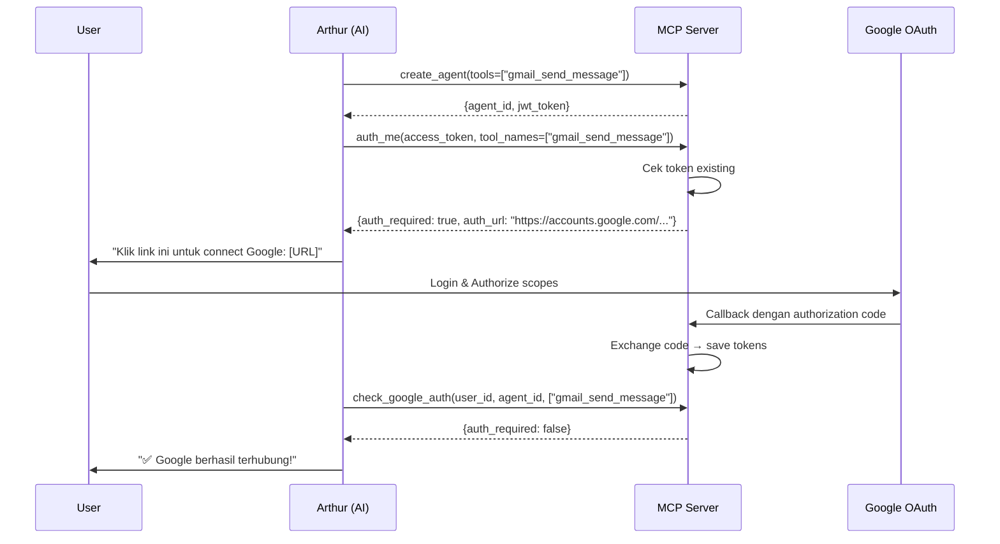

# 🔑 Google Auth Tools — Dokumentasi

Kategori ini mencakup tools untuk mengelola Google OAuth authentication, generate auth URL, dan memeriksa status token.

> 📁 Bagian dari [MCP Server Documentation](../README.md)

---

## Daftar Tools

| Tool | Deskripsi Singkat |
|---|---|
| [`check_google_auth`](#check_google_auth) | Periksa apakah user sudah punya token Google valid |
| [`get_google_auth_url`](#get_google_auth_url) | Generate Google OAuth URL |
| [`get_user_auth_tokens`](#get_user_auth_tokens) | Ambil token OAuth yang tersimpan |

---

## `check_google_auth`

**Periksa apakah user sudah memiliki Google OAuth token yang valid untuk tools yang digunakan.**

Tool ini melakukan **dua tahap pengecekan**:
1. **Pass 1**: Cek token pada level agent (agent-scoped)
2. **Pass 2**: Fallback ke token pada level user (user-level, tanpa agent_id)

Jika salah satu pass berhasil, `auth_required` akan `false` dan tidak perlu kirim auth URL ke user lagi.

### Parameter

| Parameter | Tipe | Wajib | Deskripsi |
|---|---|---|---|
| `user_id` | `str` | ✅ Ya | UUID user |
| `agent_id` | `str` | ✅ Ya | UUID agent (boleh string kosong `""` jika ingin cek tanpa agent scope) |
| `tool_names` | `list\|str` | ❌ Tidak | Daftar nama tools yang perlu Google auth (e.g., `["gmail_send_message"]`) |

### Response — Auth Tidak Diperlukan

```json
{
  "status": "success",
  "auth_required": false,
  "auth_url": null,
  "auth_state": null
}
```

### Response — Auth Diperlukan

```json
{
  "status": "success",
  "auth_required": true,
  "auth_url": "https://accounts.google.com/o/oauth2/v2/auth?client_id=...&scope=...&state=...",
  "auth_state": "eyJhbGciOiJIUzI1NiJ9..."
}
```

### Alur Dua-Tahap

```
check_google_auth(user_id, agent_id, tool_names)
         │
         ├─ Pass 1: Cek token agent-scoped
         │   └─ Token valid? → return auth_required: false ✅
         │
         ├─ Pass 2: Cek token user-level (tanpa agent_id)
         │   └─ Token valid? → return auth_required: false ✅
         │
         └─ Tidak ada token valid → return auth_url untuk login ❌
```

> 💡 **Catatan Penting**: Token yang di-generate via `auth_me` endpoint (JWT-based) disimpan tanpa `agent_id` spesifik. Pass 2 memastikan token ini tetap terdeteksi.

### Contoh Penggunaan

```python
# Cek sebelum mengirimkan pesan Gmail
result = await check_google_auth(
    user_id="550e8400-e29b-41d4-a716-446655440000",
    agent_id="660e8400-e29b-41d4-a716-446655440001",
    tool_names=["gmail_send_message", "gmail_read_messages"]
)
data = json.loads(result)

if data["auth_required"]:
    # Kirim link ke user
    print(f"Silakan hubungkan Google Anda: {data['auth_url']}")
else:
    print("✅ Google sudah terhubung, agent siap menggunakan Gmail!")
```

---

## `get_google_auth_url`

**Generate Google OAuth authorization URL dengan scopes tertentu.**

Tool ini lebih generik dari `check_google_auth` — langsung generate URL tanpa mengecek token yang ada terlebih dahulu. Gunakan saat ingin memaksa re-authentication atau saat `user_id`/`agent_id` belum diketahui.

### Parameter

| Parameter | Tipe | Wajib | Default | Deskripsi |
|---|---|---|---|---|
| `user_id` | `str` | ❌ Tidak | `""` | UUID user (opsional) |
| `agent_id` | `str` | ❌ Tidak | `""` | UUID agent (opsional) |
| `scopes` | `list\|str` | ❌ Tidak | `null` | Daftar OAuth scope URL yang diminta |

### Response Sukses

```json
{
  "status": "success",
  "auth_url": "https://accounts.google.com/o/oauth2/v2/auth?client_id=...&scope=...&state=...&access_type=offline",
  "auth_state": "eyJhbGciOiJIUzI1NiJ9..."
}
```

> 📌 **Catatan Implementasi**: Response ini menggunakan spread (`**result`) dari `auth_service.create_google_auth_url()`. Key yang dikembalikan bisa bervariasi, tapi `auth_url` selalu ada.

### Scopes yang Umum Digunakan

```python
# Gmail (kirim + baca)
gmail_scopes = [
    "https://www.googleapis.com/auth/gmail.send",
    "https://www.googleapis.com/auth/gmail.readonly"
]

# Google Calendar
calendar_scopes = [
    "https://www.googleapis.com/auth/calendar.events",
    "https://www.googleapis.com/auth/calendar.readonly"
]

# Google Sheets
sheets_scopes = [
    "https://www.googleapis.com/auth/spreadsheets",
    "https://www.googleapis.com/auth/spreadsheets.readonly"
]

# Google Drive
drive_scopes = [
    "https://www.googleapis.com/auth/drive.file",
    "https://www.googleapis.com/auth/drive.readonly"
]
```

### Contoh Penggunaan

```python
# Generate URL untuk semua Google services
result = await get_google_auth_url(
    user_id="550e8400-e29b-41d4-a716-446655440000",
    agent_id="660e8400-e29b-41d4-a716-446655440001",
    scopes=[
        "https://www.googleapis.com/auth/gmail.send",
        "https://www.googleapis.com/auth/calendar.events",
        "https://www.googleapis.com/auth/spreadsheets"
    ]
)
data = json.loads(result)
print(f"Kunjungi URL ini untuk login Google:\n{data['auth_url']}")

# Generate URL tanpa user/agent (untuk akun anonim)
result = await get_google_auth_url(scopes=["https://www.googleapis.com/auth/gmail.send"])
```

---

## `get_user_auth_tokens`

**Ambil daftar token OAuth yang tersimpan untuk user.**

Berguna untuk mengaudit token apa saja yang sudah di-authorize user, scope apa yang di-cover, dan kapan token expire.

### Parameter

| Parameter | Tipe | Wajib | Default | Deskripsi |
|---|---|---|---|---|
| `user_id` | `str` | ✅ Ya | — | UUID user |
| `agent_id` | `str` | ❌ Tidak | `""` | UUID agent (filter token untuk agent tertentu) |

### Response Sukses

```json
{
  "status": "success",
  "tokens": [
    {
      "id": "bb0e8400-e29b-41d4-a716-446655440020",
      "service": "google",
      "scope": [
        "https://www.googleapis.com/auth/gmail.send",
        "https://www.googleapis.com/auth/calendar.events"
      ],
      "expires_at": "2026-03-26T11:57:24",
      "created_at": "2026-02-26T11:57:24"
    }
  ]
}
```

### Field Response

| Field | Tipe | Deskripsi |
|---|---|---|
| `id` | `str` | UUID token record |
| `service` | `str` | Layanan (saat ini selalu `"google"`) |
| `scope` | `list\[str\]` | Daftar OAuth scope yang di-authorize |
| `expires_at` | `str\|null` | Waktu expired (`null` = tidak ada expiry) |
| `created_at` | `str` | Waktu token dibuat |

### Contoh Penggunaan

```python
# Ambil semua token user
result = await get_user_auth_tokens(user_id="550e8400-e29b-41d4-a716-446655440000")
data = json.loads(result)

for token in data["tokens"]:
    print(f"\nService: {token['service']}")
    print(f"Scopes: {', '.join(token['scope'])}")
    print(f"Expires: {token['expires_at'] or 'Tidak ada expiry'}")

# Ambil token khusus untuk agent tertentu
result = await get_user_auth_tokens(
    user_id="550e8400-e29b-41d4-a716-446655440000",
    agent_id="660e8400-e29b-41d4-a716-446655440001"
)
agent_tokens = json.loads(result)["tokens"]
print(f"Token untuk agent ini: {len(agent_tokens)}")
```

---

## Alur Lengkap Google Auth



---

## Perbedaan `auth_me` vs `check_google_auth` vs `get_google_auth_url`

| Aspek | `auth_me` | `check_google_auth` | `get_google_auth_url` |
|---|---|---|---|
| Input | JWT access_token | user_id + agent_id | user_id + agent_id |
| Cek token existing | ✅ Ya | ✅ Ya (2 pass) | ❌ Tidak |
| Generate URL | ✅ Ya | ✅ Ya (jika perlu) | ✅ Selalu |
| Use case | Setelah register/login | Sebelum eksekusi tools | Force re-auth |

---

*← Kembali ke [MCP Server Documentation](../README.md)*
